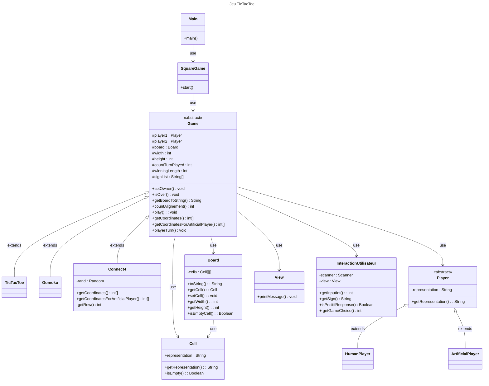
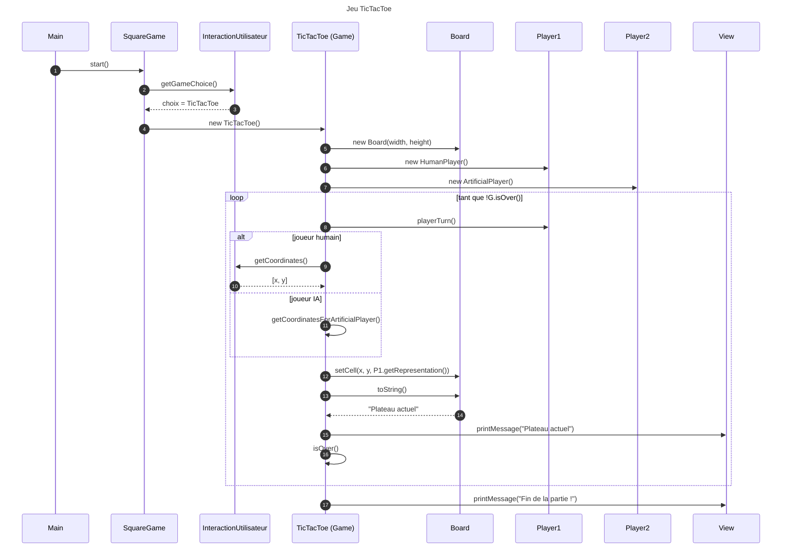

# TicTacToe
## Introduction
Un jeu de plateau de la société square game, codé en Java

## Les classes
`TicTacToe` :
- tableau a deux dimensions de `Cell`
- la taille du plateau
- un attribut `player1` de type `Player`
- un attribut `player2`de type `Player`
- la méthode `display` parcourt le tableau pour afficher son contenu
- la méthode `getMoveFromPlayer` récupère l’entrée utilisateur, X et Y, qui doit être un entier dans le tableau de jeux et doit être une case libre. Recommence tant que ce n'est pas valide.
- la méthode `setOwner` prend en paramètre les coordonnées X et Y, et le Player. Met à jour le tableau pour ajouter la case du joueur
- la méthode `play` qui gère la logique du jeu, le jeu s’arrête si les 9 cases sont remplies
- la méthode `isOver` retourne ”true” si trois pions sont alignés ou si le plateau est rempli

`Cell`:
- un attribut `representation` qui stock le contenu de la `Cell`
- une méthode qui retourne son contenu

`Player` :
- Un attribut `representation` qui prend comme valeur “X” ou “O”
- Une méthode `getRepresentation` qui retourne la representation

## Diagramme UMLœ

## Diagramme de séquence

## Exemple de sortie console
```bash
-------------
|   |   |   |
-------------
|   |   |   |
-------------
|   |   |   |
-------------
```
```bash
-------------
| O |   |   |
-------------
|   | X |   |
-------------
|   |   |   |
-------------
```